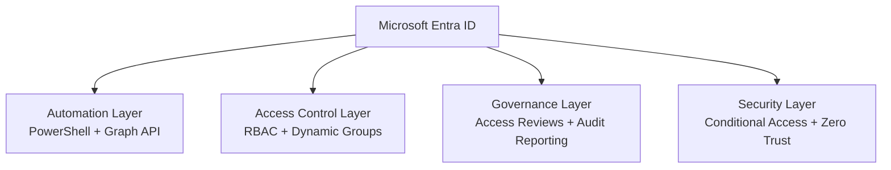
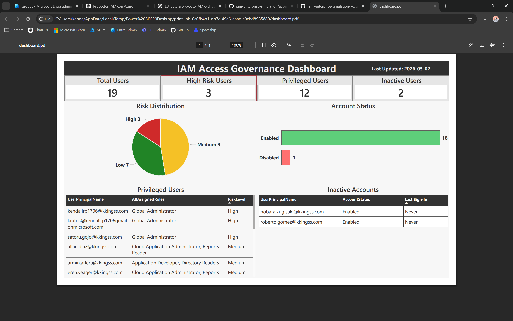
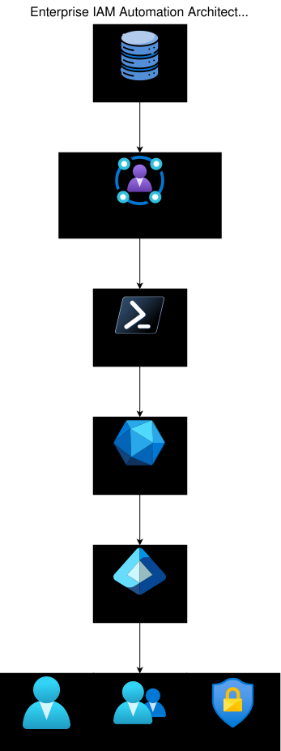

# IAM Enterprise Simulation

## Overview

This project simulates a modern enterprise Identity and Access Management (IAM) environment built using Microsoft Entra ID, Microsoft Graph API, PowerShell, and Zero Trust security principles.

The implementation focuses on:

- Identity lifecycle automation
- RBAC and ABAC access control
- IAM governance and audit readiness
- Conditional Access and Zero Trust
- Microsoft Graph API orchestration

---

## Enterprise Architecture

The environment models a centralized identity architecture where Microsoft Entra ID acts as the primary identity control plane.

---

## Implemented Capabilities

| Area | Implementation |
|---|---|
| Lifecycle Management | Automated Joiner / Mover / Leaver workflows |
| Authorization Model | RBAC, ABAC, and Dynamic Groups |
| Access Protection | Conditional Access and Zero Trust controls |
| Governance | Access Reviews and audit reporting |
| Automation | Microsoft Graph API orchestration |
| Authentication | Certificate-based app authentication |

---

## Project Modules

### Lifecycle Automation — Module 1

🔗 **[Module Details](lifecycle-automation/README.md)**

Implements automated Joiner, Mover, and Leaver (JML) workflows using PowerShell and Microsoft Graph API.

#### Highlights

- Automated user provisioning and deprovisioning
- RBAC-based access assignment
- Differential attribute updates
- Automated group reassignment
- Structured audit logging and reporting

#### Technologies

- PowerShell
- Microsoft Graph API
- Microsoft Entra ID

---

### Access Governance — Module 2

🔗 **[Module Details](access-governance/README.md)**

Implements IAM governance, access reviews, and audit reporting workflows.

#### Highlights

- Access Reviews
- Risk-based access classification
- Governance-aligned RBAC controls
- Audit simulation scenarios
- Automated IAM reporting
- Power BI governance dashboard

#### Technologies

- Microsoft Entra ID Identity Governance
- PowerShell
- Microsoft Graph API
- Power BI

---

### Access Control Models — Module 3

🔗 **[Module Details](access-control-models/README.md)**

Implements layered RBAC and ABAC access control with Dynamic Groups and Conditional Access enforcement.

#### Highlights

- RBAC and ABAC integration
- Dynamic Groups
- Conditional Access architecture
- Context-aware access enforcement
- Privileged access hardening
- Zero Trust validation scenarios

#### Technologies

- Microsoft Entra ID
- Conditional Access
- Dynamic Groups
- PowerShell

---

### Automation API — Module 4

🔗 **[Module Details](automation-api/README.md)**

Implements an IAM automation and orchestration layer using Microsoft Graph API, PowerShell, and Microsoft Entra ID.

  

#### Highlights

- Event-driven identity lifecycle processing
- Automated Joiner / Mover / Leaver workflows
- REST API and SDK hybrid integration model
- App-only authentication using certificates
- Governance validation pipeline
- Structured operational logging and reporting
- Microsoft Graph API orchestration

#### Technologies

- Microsoft Entra ID
- Microsoft Graph API
- Microsoft Graph PowerShell SDK
- PowerShell
- JSON
- Power Bi

---

### Security – Zero Trust — Module 5 *(In Progress)*

Implements Zero Trust security principles focused on identity-centric security controls.

#### Planned Features

- Identity Protection
- Risk-based access controls
- Phishing-resistant authentication
- Continuous verification
- Advanced Conditional Access scenarios

---

## Technologies

- Microsoft Entra ID (Azure AD)
- Microsoft Graph API
- PowerShell
- Power BI
- Conditional Access
- Dynamic Groups

---

## Current Project Status

| Module | Status |
|---|---|
| Lifecycle Automation | ✅ Completed |
| Access Governance | ✅ Completed |
| Access Control Models | ✅ Completed |
| Automation API | ✅ Completed |
| Security – Zero Trust | 🚧 In Progress |

---

## Project Goal

The goal of this project is to demonstrate practical enterprise IAM engineering skills through automation, governance, access control, and Zero Trust security implementations aligned with real-world identity operations.

---

## Notes

This project was created for learning, portfolio, and professional development purposes while following modern enterprise IAM and Zero Trust practices.
