# Access Control Validation

## Overview

This document validates the access control model through multiple identity and access test scenarios.

The validation covers:

- Dynamic group assignment
- Context-aware access enforcement
- Conditional Access protection
- RBAC and ABAC integration

## SCENARIO 1 — Dynamic Access Assignment

1. The new Finance Accounting Manager "Peter Parker" was added into the HR system with the correct attributes for its role:

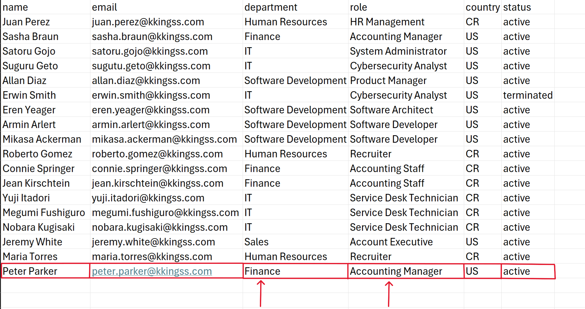

Based on the user attributes, he will be assigned to the following groups:
   
- IAM-ALL-Active-Member-Users (This group lists all active member users)
- IAM-ALL-Tenant-Users (This group lists all users in the tenant)
- IAM-APP-QuickBooks-Finance-Users (This group provides finance users with access to QuickBooks ERP)
- IAM-APP-ServiceNow-Users (This group provides users with access to ServiceNow)
- IAM-Finance-Accounting Manager (This group provides finance users with tenant and Azure roles)
- LIC-BASE-Active-Users (This group assigns the base licenses require to users)

2. Some group dynamic rules configurations:

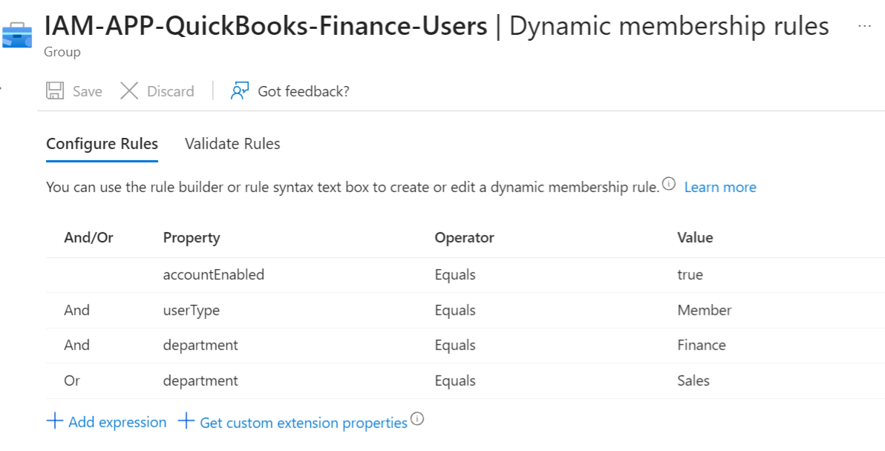
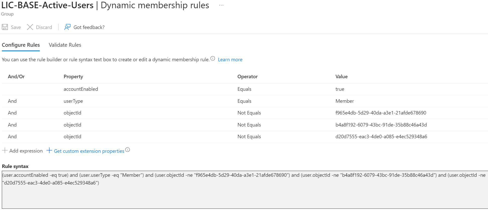
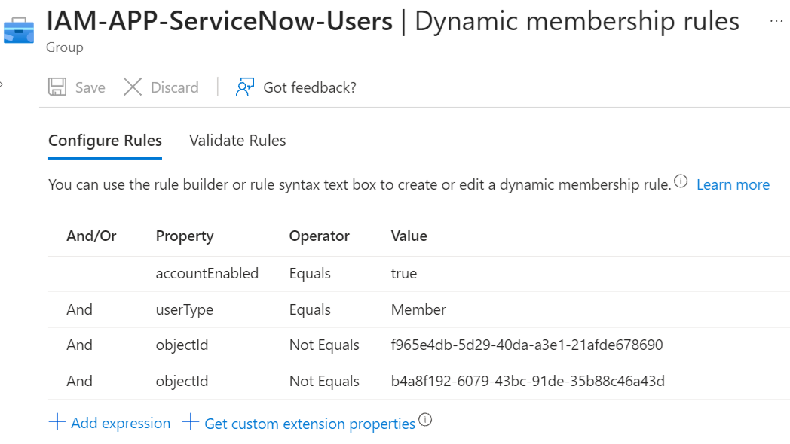

3. The user got successfully assigned to the required groups and required access:

4. The user has the required role assignments, access to apps, and required licenses to complete his day-to-day work:

## SCENARIO 2 — Attribute Change Removes Access

1. Now the user "Peter Parker" will move from beign the Accounting Manager for the Finance team to HR Management for the Human Resources department, this is his current group memebership, he is in the "IAM-Finance-Accounting Manager" group and the "IAM-APP-QuickBooks-Finance-Users":

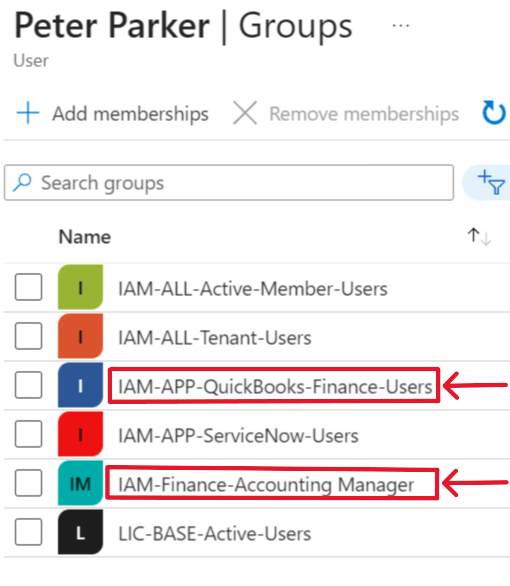

2. The attributes were updated in the HR system:

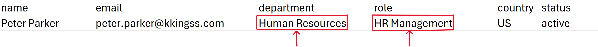

3. The user group membership was automatically updated, he doesn't have the "IAM-Finance-Accounting Manager" group and the "IAM-APP-QuickBooks-Finance-Users" anymore and now he has the "IAM-Human Resources-HR Management" group:

4. He doesn't have access to the Finance apps anymore, and his tenant and Azure roles were updated to the necessary roles for its current position:

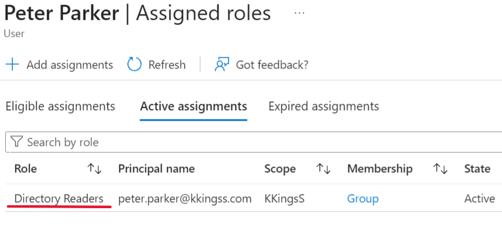

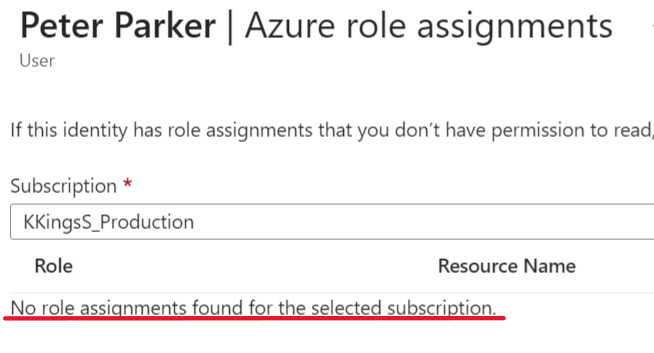

## SCENARIO 3 — Admin Blocked by Conditional Access

1. The System Administrator "Satoru Gojo" tried to sign-in to the Entra Admin Center portal from an unregistered device, he received an error message:

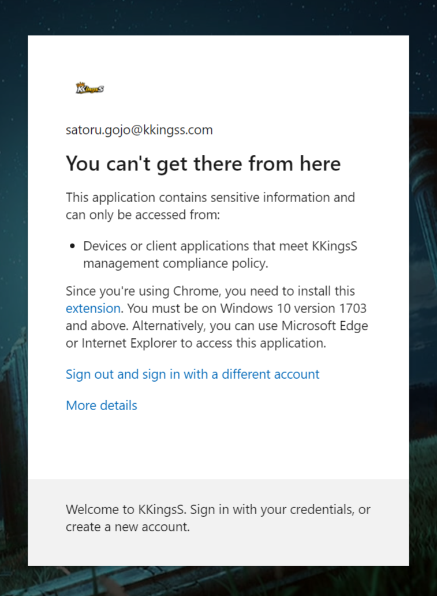

2. The sign-in logs shows the failure attempt to sign-in and the reason of the failure with some more information:

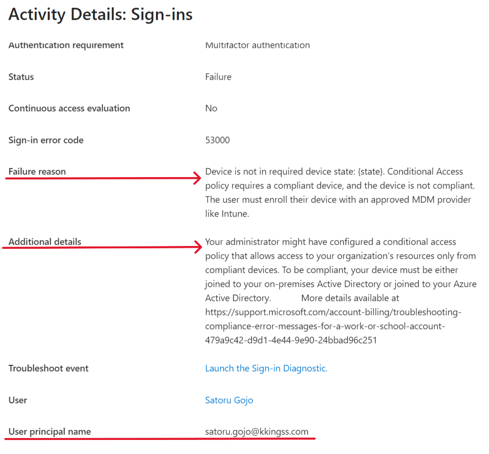

3. We can also see the Conditional Access policy that blocked the access because the conditions were not satisfied, in this case the System Administrator should be using a compliant device:

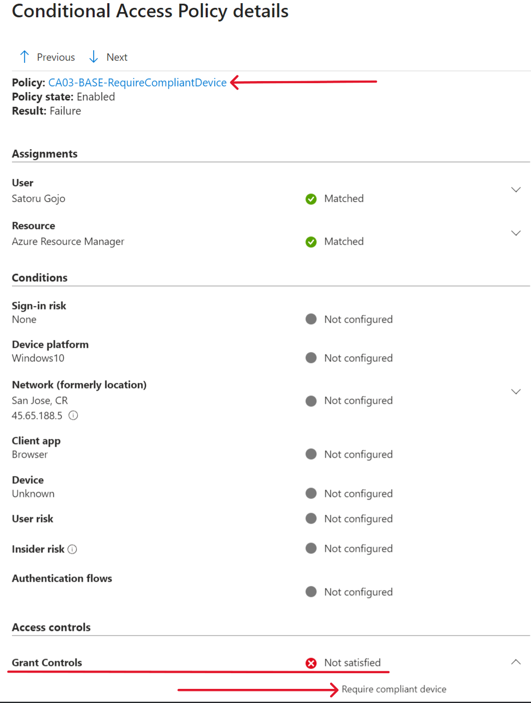
