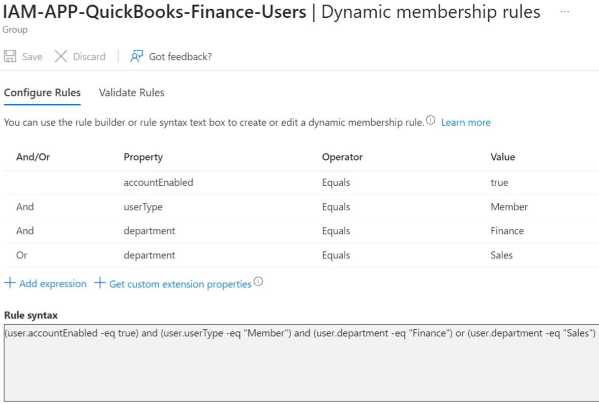
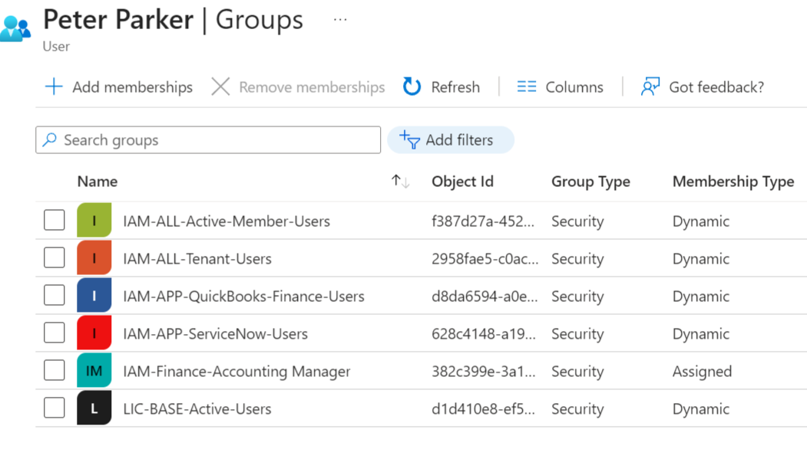
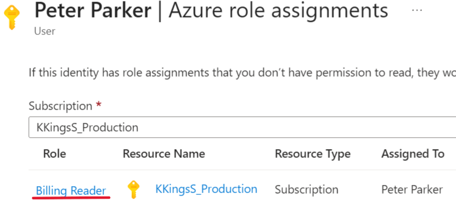
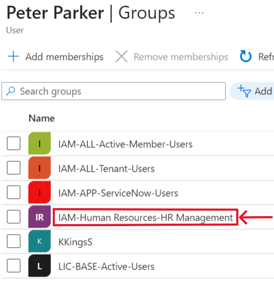
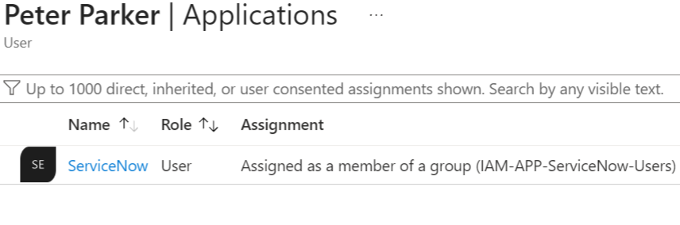
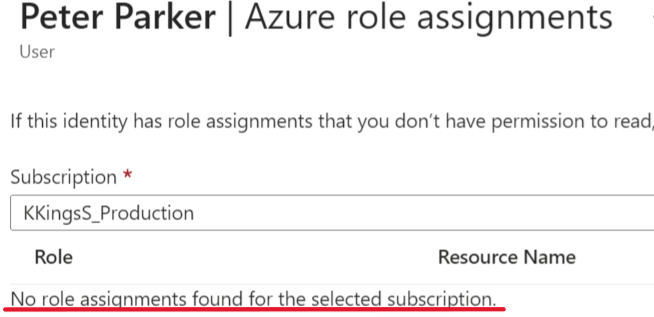
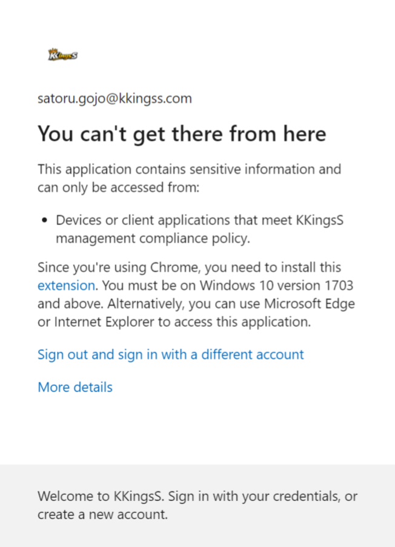
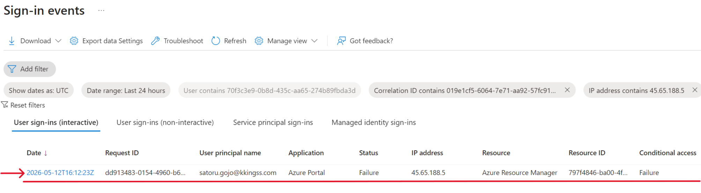

# Access Control Validation

## Overview

This document validates the implemented access control model through multiple identity and access management test scenarios.

The validation covers:

- Dynamic group assignment
- Context-aware access enforcement
- Conditional Access protections
- RBAC and ABAC integration

---

## Scenario 1 — Automated Dynamic Access Provisioning

### 1. User Provisioning

A new Finance Accounting Manager user was provisioned through the HR system with the appropriate identity attributes for the assigned role.

Based on the assigned identity attributes, the user was automatically added to the following groups:

- IAM-ALL-Active-Member-Users  
  Contains all active internal users with the `Member` user type

- IAM-ALL-Tenant-Users  
  Contains all users within the tenant

- IAM-APP-QuickBooks-Finance-Users  
  Provides Finance users with access to QuickBooks ERP

- IAM-APP-ServiceNow-Users  
  Provides users with access to ServiceNow

- IAM-Finance-Accounting Manager  
  Provides Finance users with the required tenant and Azure role assignments

- LIC-BASE-Active-Users  
  Assigns the required baseline licenses to active users

---

### 2. Dynamic Group Configuration

The following screenshot shows an example of the implemented dynamic membership rules used for automated access assignment.

---

### 3. Automatic Group Assignment

The user was successfully assigned to the required groups and inherited the corresponding access permissions.

---

### 4. Access Validation

The user received the required role assignments and application access necessary to perform daily job responsibilities.

### Result

Access was automatically provisioned based on user identity attributes and dynamic group membership without manual intervention.

---

## Scenario 2 — Automatic Access Revocation After Attribute Change

### 1. Initial Access State

The user transitioned from the Finance Accounting Manager role to HR Management within the Human Resources department.

The following screenshots show the user’s initial group membership and Finance-related access assignments.

At this stage, the user was assigned to:

- IAM-Finance-Accounting Manager
- IAM-APP-QuickBooks-Finance-Users

---

### 2. Attribute Update

The user identity attributes were updated in the HR system to reflect the new department and role assignment.

---

### 3. Automatic Access Update

Following the attribute update, the user’s group memberships were automatically reevaluated and updated.

Finance-related access assignments were automatically revoked and the user was assigned to the Human Resources role group.

---

### 4. Access Revalidation

Finance application access and role assignments were automatically revoked.

The user inherited the appropriate application access and role assignments required for the assigned business role.

### Result

Access was automatically revoked and reassigned based on updated identity attributes without requiring manual administrator intervention.

---

## Scenario 3 — Conditional Access Enforcement for Privileged Access

### 1. Blocked Administrative Sign-In Attempt

A System Administrator attempted to sign in to the Microsoft Entra Admin Center from a non-compliant and unregistered device.

The access attempt was blocked by Conditional Access controls.

---

### 2. Sign-In Log Validation

The sign-in logs show the failed authentication attempt, including the failure reason and additional access evaluation details.

---

### 3. Conditional Access Evaluation

The Conditional Access policy evaluation confirms that access was blocked because the required security conditions were not satisfied.

In this scenario, privileged access required the use of a compliant device.

### Result

Conditional Access policies successfully enforced privileged access restrictions and prevented administrative access from non-compliant devices.

---

## Conclusion

The validation scenarios confirmed that the implemented access control model correctly enforces:

- Automated RBAC and ABAC access assignment
- Dynamic access revocation based on identity changes
- Conditional Access protections for privileged users
- Context-aware and risk-aware security controls

The implementation demonstrates a scalable, automated, and governance-aligned enterprise IAM architecture following Zero Trust security principles.
