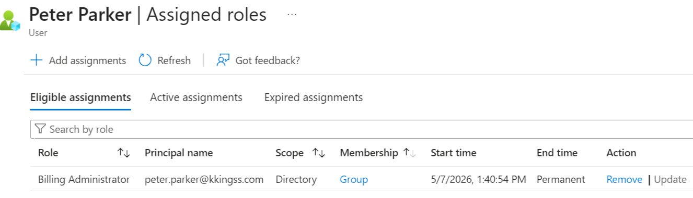
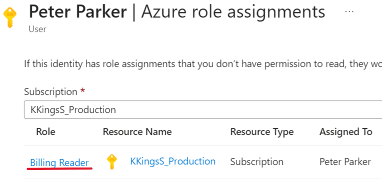
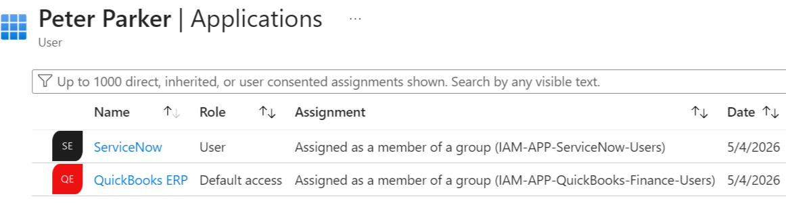
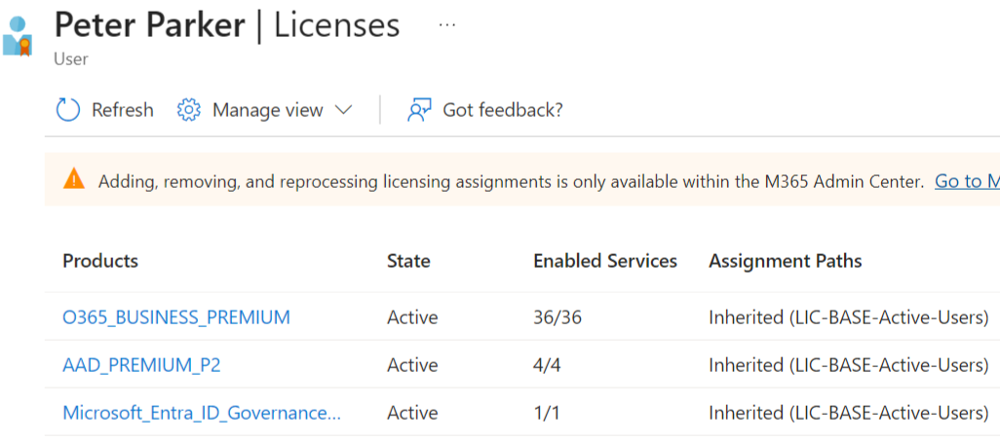

# Access Control Validation

## Overview

This document validates the access control model through multiple identity and access test scenarios.

The validation covers:

- Dynamic group assignment
- Context-aware access enforcement
- Conditional Access protection
- RBAC and ABAC integration

## ESCENARIO 1 — Dynamic Access Assignment

1. The new Finance Accounting Manager "Peter Parker" was added into the HR system with the correct attributes for its role.

Based on the user attributes, he will be assigned to the following groups:
   
- IAM-ALL-Active-Member-Users (This group lists all active member users)
- IAM-ALL-Tenant-Users (This group lists all users in the tenant)
- IAM-APP-QuickBooks-Finance-Users (This group provides finance users with access to QuickBooks ERP)
- IAM-APP-ServiceNow-Users (This group provides users with access to ServiceNow)
- IAM-Finance-Accounting Manager (This group provides finance users with tenant and Azure roles)
- LIC-BASE-Active-Users (This group assigns the base licenses require to users)

2. Some group dynamic rules configurations:
   

3. The user got successfully assigned to he required groups and required access:

4. The user has the required role assignments, access to apps, and required licenses to complete his day-to-day work:

## ESCENARIO 2 — Attribute Change Removes Access

1. 
