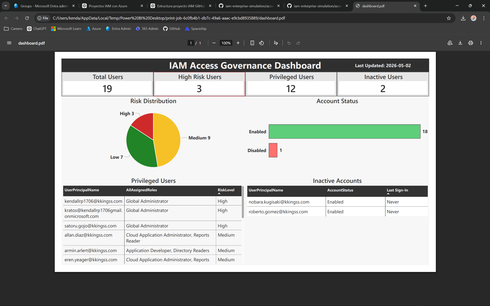

# Access Governance Module

## Overview

This module simulates an enterprise-grade Identity and Access Management (IAM) governance framework using Microsoft Entra ID.

It demonstrates how organizations enforce Role-Based Access Control (RBAC), perform periodic access reviews, and maintain audit-ready visibility into user access across different risk levels.



## Key Capabilities

- Role-Based Access Control (RBAC) using IAM-managed groups
- Risk-based access classification (High / Medium / Low)
- Periodic Access Reviews aligned with governance policies
- Detection and remediation of unauthorized access
- Automated access reporting using PowerShell and Microsoft Graph
- Visual access monitoring through a Power BI dashboard

## Governance Approach

Access is managed through a structured model:

- Group-Based Access Control
  - All permissions are assigned via IAM-managed groups
 
- Risk Classification Model
  - Access is categorized based on privilege level, data sensitivity, and business impact

- Access Reviews
  - Periodic validation of access to ensure compliance

- Audit Simulation
  - Realistic scenarios to validate control effectiveness

## Project Structure

```bash
access-governance/
│
├── docs/
│   ├── business-rules.md
│   ├── risk-classification.md
│   └── audit-simulation.md
│
├── scripts/
│   └── generate-access-report.ps1
│
├── reports/
│   ├── iam-access-audit-report.csv
│   ├── executive-summary.md
│   └── dashboard.png
│
├── evidence/
│   ├── access-reviews/
│   └── screenshots/
```

## IAM Dashboard

The dashboard provides a consolidated view of:

- Access risk distribution
- Privileged users
- Account activity
- Inactive accounts

It aligns directly with the defined risk model and automated reporting.

## Audit Simulation

The module includes a realistic audit simulation covering:

- Unauthorized privileged access detection and remediation
- Validation of legitimate privileged access
- Review of medium-risk financial access

See full audit simulation: [Audit Simulation](docs/audit-simulation.md)

## Key Outcomes

- Successfully detected and remediated unauthorized privileged access
- Validated RBAC alignment across all access levels
- Established a consistent risk model across documentation, automation, and reporting
- Delivered audit-ready evidence and reporting artifacts

## Technologies Used

- Microsoft Entra ID
- Microsoft Graph API
- PowerShell
- Power BI

## Conclusion

This module demonstrates how IAM governance controls can be implemented, validated, and visualized in a structured and audit-ready manner.

It reflects real-world practices used in enterprise environments to manage identity security, enforce least privilege, and support compliance requirements.
