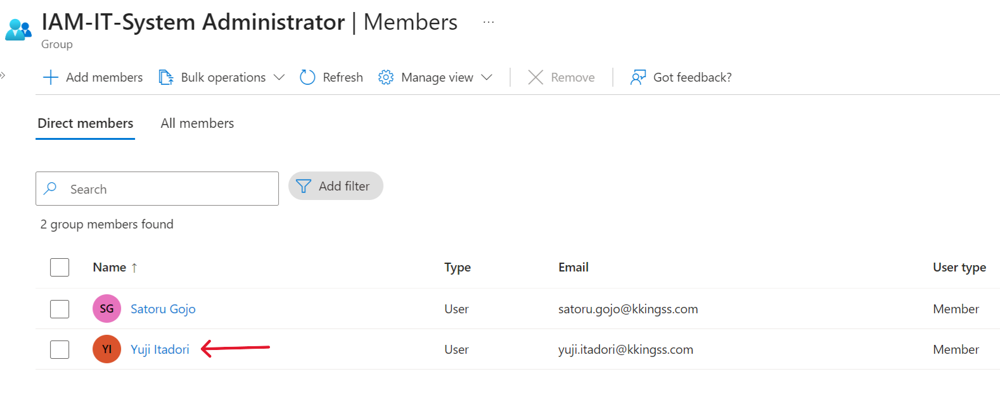
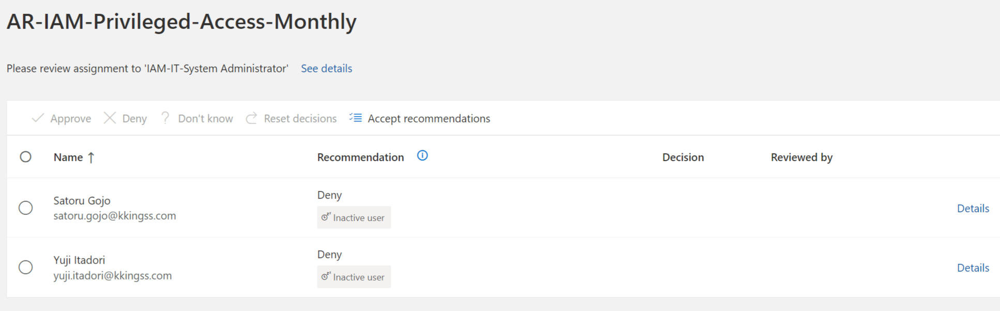
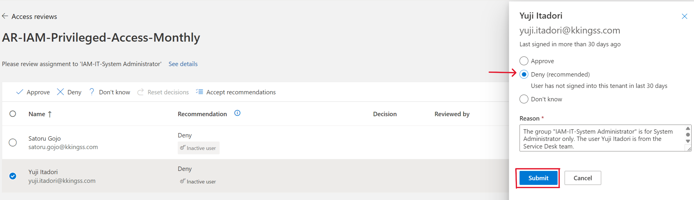
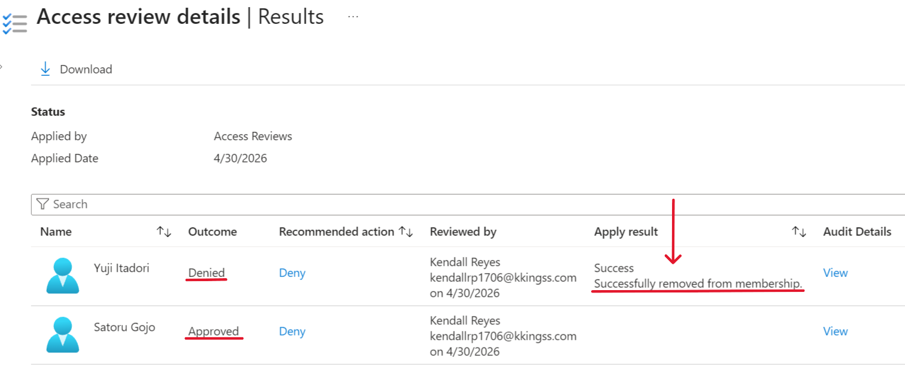
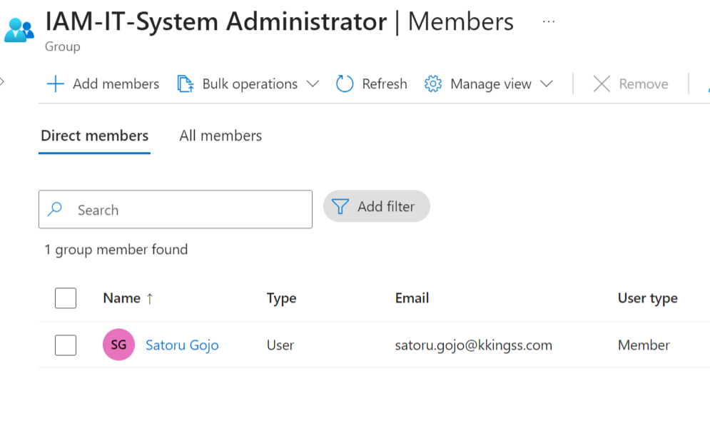
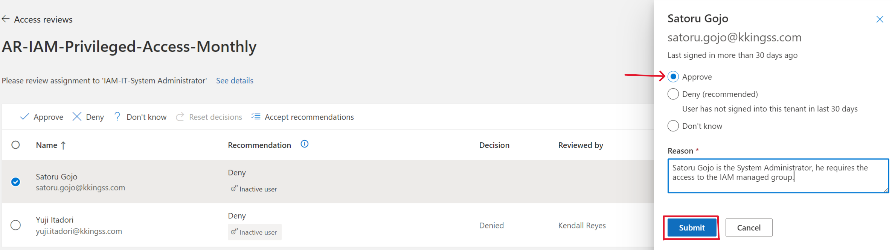

# Access Review Audit Simulation

## Objective

Validate that access across different risk levels is correctly assigned and enforced through Access Reviews.

## Scope

- Privileged Access (High Risk)
- Financial Access (Medium Risk)
- Business Access (Low Risk)

## Scenario 1: Unauthorized Privileged Access (High Risk)

### Finding

A Service Desk user (Yuji Itadori) was incorrectly assigned to a privileged IAM group (IAM-IT-System Administrator).

### Risk

Privilege escalation and potential system compromise.

### Action

Access was denied and removed through Access Review.

### Outcome

Access successfully remediated.

## Scenario 2: Valid Privileged Access (High Risk)

### Finding

A user (Satoru Gojo) with the correct administrative role was assigned to the privileged group (IAM-IT-System Administrator).

### Validation

Access aligns with RBAC definition and job responsibilities.

### Action

Access was approved with justification.

### Outcome

Access retained as compliant.

## Scenario 3: Financial Access Review (Medium Risk)

### Finding

All users had appropriate access based on their roles.

### Action

Access approved.

### Outcome

No remediation required.

## Control Effectiveness

- Unauthorized access detected and removed
- Valid access confirmed and justified
- Reviews executed based on risk classification

## Conclusion

The access review framework effectively enforces RBAC policies and supports governance by detecting and remediating inappropriate access while validating legitimate permissions.

## Evidence

### Scenario 1 – Unauthorized Access

- Initial state:

- Access review detection:

- Remediation action:

- Post-remediation state:

### Scenario 2 – Valid Access

- Approved user:

## Access Review Results

