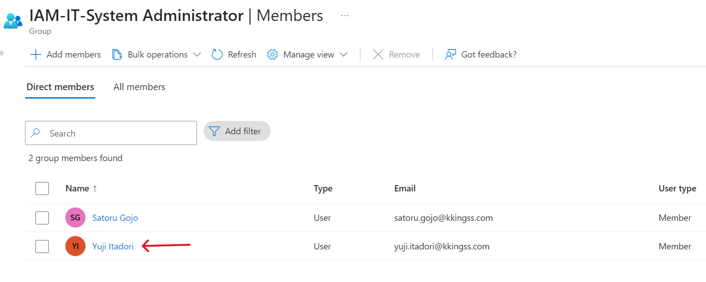
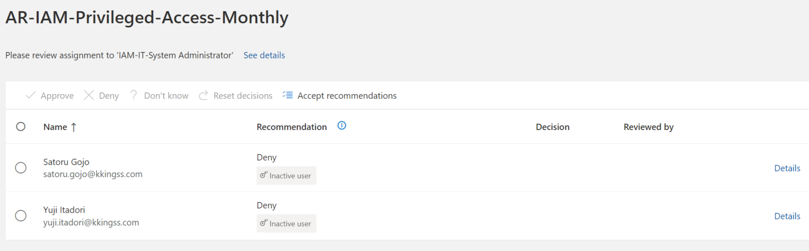
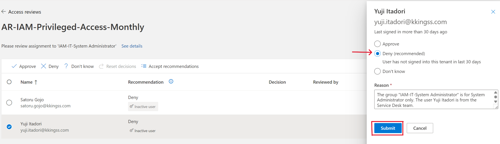
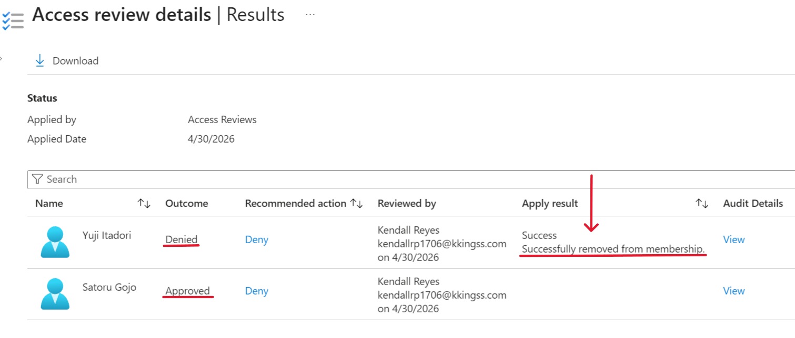
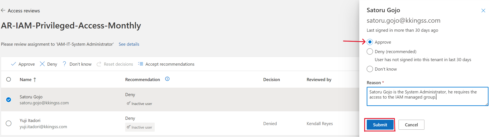

# Access Review Audit Simulation

## Overview

This document validates the effectiveness of the implemented access review and governance processes.

The simulation demonstrates how Microsoft Entra ID Access Reviews can detect, validate, and remediate inappropriate access assignments in alignment with RBAC policies and risk-based governance controls.

---

## Scope

| Risk Level | Access Type |
|---|---|
| High | Privileged administrative access |
| Medium | Financial and operational access |
| Low | Standard business access |

---

## Review Methodology

Access Reviews were conducted against IAM-managed security groups to validate whether assigned access aligned with:

- Business responsibilities
- RBAC definitions
- Risk classification requirements
- Least privilege principles

---

## Scenario 1: Unauthorized Privileged Access

### Finding

A Service Desk user was incorrectly assigned to the `IAM-IT-System Administrator` privileged group.

### Risk

Unauthorized privileged access introduced the risk of privilege escalation and administrative compromise.

### Remediation

The access assignment was denied and removed through the Access Review process.

### Result

The unauthorized access was successfully remediated and RBAC compliance was restored.

---

## Scenario 2: Valid Privileged Access

### Finding

A privileged user maintained access aligned with assigned job responsibilities.

### Validation

The assignment was reviewed and validated against the approved RBAC model.

### Result

Access was approved and retained as compliant.

---

## Scenario 3: Financial Access Review

### Finding

Financial access assignments were reviewed and confirmed to align with business responsibilities.

### Result

No remediation actions were required.

---

## Control Effectiveness

The access review process successfully demonstrated:

- Detection of unauthorized privileged access
- Validation of legitimate access assignments
- Risk-based access governance
- Periodic review enforcement
- Audit-ready access visibility

---

## Dashboard Validation

The IAM dashboard was used to visualize and validate:

- User risk distribution
- Privileged access exposure
- Inactive accounts
- Governance review outcomes

This alignment ensures consistency across governance controls, reporting, and audit processes.

---

## Evidence

### Scenario 1 — Unauthorized Privileged Access

#### Initial Unauthorized Assignment

#### Access Review Detection

#### Remediation Action

#### Post-Remediation Validation

---

### Scenario 2 — Valid Privileged Access

#### Approved Access Validation

---

## Conclusion

The implemented access review framework demonstrates a governance-aligned IAM process capable of:

- Detecting and remediating unauthorized access
- Validating legitimate role assignments
- Supporting periodic governance reviews
- Providing audit-ready access visibility

The implementation reflects enterprise IAM governance practices aligned with least privilege and Zero Trust security principles.
