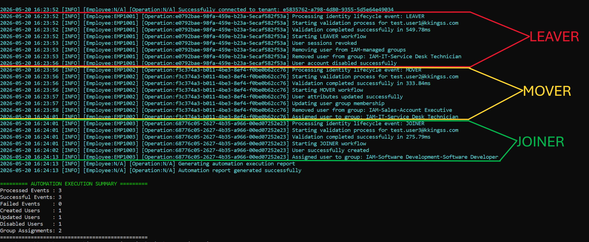

# Automation API - Module 4

## Overview

This module implements an enterprise-style IAM automation and orchestration layer using Microsoft Graph API, PowerShell, and Microsoft Entra ID.

The solution simulates how modern organizations automate identity lifecycle operations by integrating HR-driven identity events with cloud identity platforms.

The automation engine processes lifecycle events and orchestrates provisioning workflows, access assignment, governance validation, and reporting operations.

---

## Core Capabilities

- Event-driven identity lifecycle processing
- Automated Joiner / Mover / Leaver (JML) workflows
- Microsoft Graph API orchestration
- App-only authentication using certificates
- Dynamic role-based access assignment
- Governance validation and policy enforcement
- Structured operational logging and reporting
- Hybrid REST API and SDK integration model

---

## Architecture

The module follows a layered automation architecture.

<p align="center">
  
</p>

---

## Automation Workflows

### JOINER

- User provisioning
- Attribute assignment
- Group-based access provisioning
- License and application access orchestration

### MOVER

- Attribute synchronization
- Dynamic access reauthorization
- Group membership updates

### LEAVER

- Session revocation
- Access removal
- Account disablement

---

## Integration Model

The automation platform uses a hybrid Microsoft Graph integration model:

| Integration Type | Usage |
|---|---|
| REST API | User provisioning and lifecycle orchestration |
| SDK Cmdlets | Group membership management and directory operations |

This approach improves operational reliability while maintaining API-driven automation workflows.

---

## Security Model

The automation engine authenticates using:

- Microsoft Entra ID App Registration
- Service Principal
- Certificate-based authentication
- App-only Microsoft Graph permissions

This simulates secure non-interactive enterprise automation.

---

## Governance Controls

The automation engine validates:

- Required identity attributes
- Email format
- Lifecycle event types
- Role mappings
- Group existence
- Duplicate identities

This ensures governance enforcement before provisioning operations are executed.

---

## Logging & Reporting



The platform generates:

- Structured operational logs
- Lifecycle execution metrics
- CSV reporting
- JSON reporting
- Audit-ready execution tracking

---

## Technical Documentation

| Document | Description |
|---|---|
| [Architecture](docs/architecture.md) | High-level automation architecture, integration model, and platform components |
| [API Flow](docs/api-flow.md) | Microsoft Graph API operations, lifecycle orchestration flows, and SDK integrations |
| [Automation Design](docs/automation-design.md) | Event-driven processing model, governance validation, and workflow design |

### Supporting Artifacts

- [High-Level Architecture Diagram](docs/evidence/high-level-architecture.drawio.svg)
- [Automation Logging Evidence](docs/evidence/automation-logs.png)

---

## Project Structure

```text
automation-api/
│
├── config/
├── data/
├── scripts/
├── logs/
└── docs/
```

---

## Technologies

- Microsoft Entra ID
- Microsoft Graph API
- Microsoft Graph PowerShell SDK
- PowerShell
- JSON

---

## Key IAM Concepts Demonstrated

- Identity lifecycle orchestration
- Event-driven IAM automation
- API-driven provisioning
- Governance validation
- RBAC-based authorization
- Structured operational logging
- App-only cloud authentication
- Enterprise IAM integration architecture

---

## Notes

This module is part of the broader IAM Enterprise Simulation project and was designed to simulate real-world enterprise IAM automation and orchestration practices.
