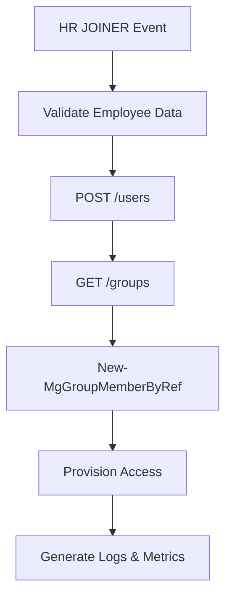
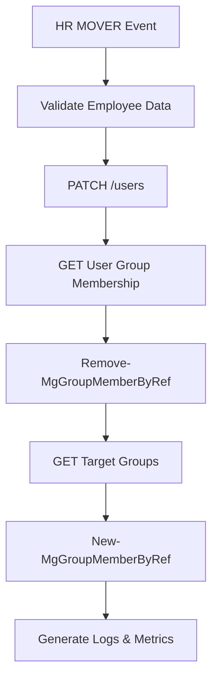
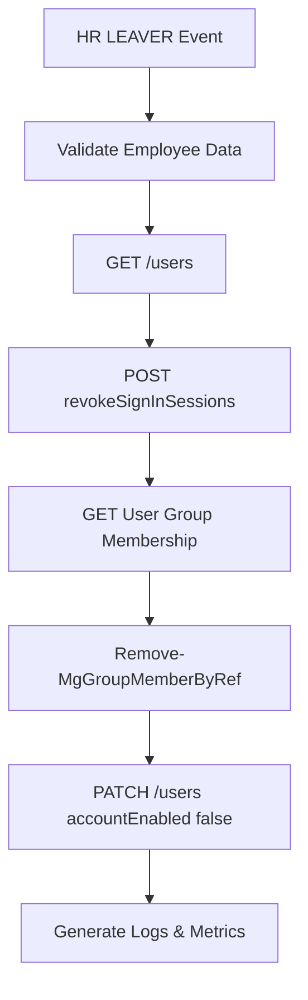

# Microsoft Graph API Flow

## Overview

This document defines the Microsoft Graph API integration flows used by the automation platform to orchestrate identity lifecycle operations within Microsoft Entra ID.

---

## Authentication

The automation engine authenticates using:

- App Registration
- Service Principal
- Certificate-based authentication
- Application permissions

---

## Graph API Operations

| Operation | Method | Endpoint |
|---|---|---|
| Create User | POST | /users |
| Update User | PATCH | /users/{id} |
| Disable User | PATCH | /users/{id} |
| Revoke Sessions | POST | /users/{id}/revokeSignInSessions |
| Query Users | GET | /users |
| Query Groups | GET | /groups |

---

## SDK Operations

The following operations are executed through Microsoft Graph PowerShell SDK cmdlets:

| Operation | Cmdlet |
|---|---|
| Add Group Member | New-MgGroupMemberByRef |
| Remove Group Member | Remove-MgGroupMemberByRef |
| Query Group Membership | Get-MgUserMemberOf |

---

## Lifecycle Flow

### JOINER

### MOVER

### LEAVER

---

## API Reliability Controls

The automation platform includes:

- Retry logic for critical Graph API operations
- Structured exception handling
- Validation controls prior to execution
- Operational logging for all lifecycle events

---

## Security Considerations

The platform follows least privilege principles by limiting application permissions to the minimum required permissions necessary for lifecycle orchestration workflows.
