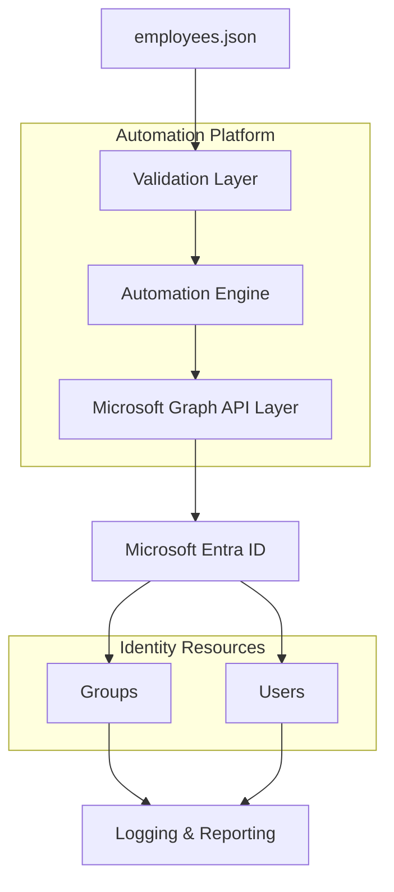
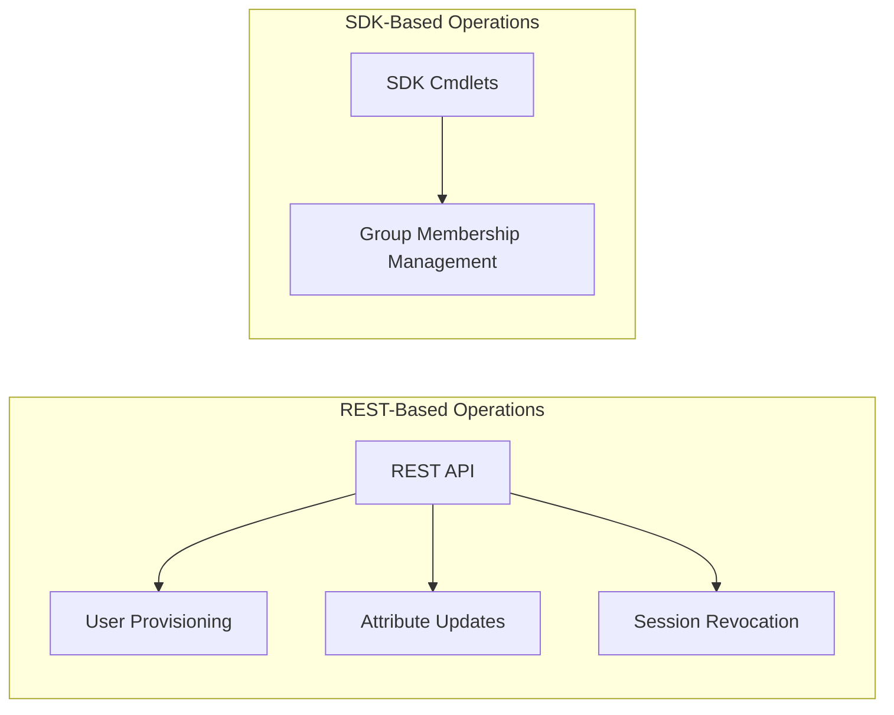

# Automation Architecture

## Overview

This document defines the architecture of the IAM automation platform used to orchestrate identity lifecycle operations through Microsoft Graph API integrations.

The platform simulates how enterprise IAM systems process identity events originating from authoritative HR systems and automate provisioning workflows within Microsoft Entra ID.

---

## Architecture Components

| Component | Purpose |
|---|---|
| HR Input Layer | Provides lifecycle event data |
| Automation Engine | Orchestrates lifecycle workflows |
| Microsoft Graph API | Executes identity operations |
| Microsoft Entra ID | Identity control plane |
| Governance Layer | Validates policy and access rules |
| Logging & Reporting Layer | Provides audit and operational visibility |

---

## Authentication Model

The automation engine authenticates using application-based authentication through:

- Microsoft Entra ID App Registration
- Service Principal
- Certificate-based authentication

This enables secure non-interactive automation without relying on delegated user sessions.

---

## Integration Model

The platform uses a hybrid Microsoft Graph integration strategy:

This design improves operational reliability while maintaining API-driven orchestration workflows.

---

## Governance Architecture

Governance validation occurs before provisioning operations are executed.

Validation controls include:

- Required attribute validation
- Role mapping validation
- Group existence validation
- Duplicate identity detection
- Lifecycle event validation

---

## Operational Visibility

The platform generates:

- Structured operational logs
- Execution metrics
- CSV reports
- JSON reports

This provides audit-ready visibility into lifecycle operations and automation outcomes.
