# Lifecycle Automation - Module 1

## Overview
This module simulates enterprise-grade Identity Lifecycle Automation, implementing Joiner, Mover, and Leaver (JML) processes using PowerShell, Microsoft Graph API, and Microsoft Entra ID. The goal is to simulate integration with an HR system, automate user provisioning, updates, deprovisioning, and apply role-based access control through dynamic group assignment while ensuring consistency, traceability, and alignment with access control policies.

## Objective

The goal of this module is to automate user lifecycle management:

- Provision new users (Joiner)
- Update existing users based on changes (Mover)
- Deprovision users securely (Leaver)

This approach ensures:
- Consistency between HR data and Entra ID
- Proper access assignment
- Auditability through logs and reporting

## Architecture Diagram

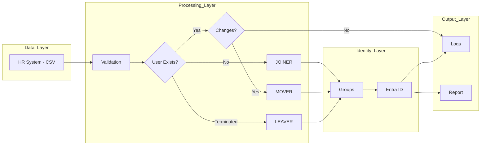

HR System (CSV) → Validation Layer → Microsoft Entra ID (via Microsoft Graph)

Processing Flow:
1. Validate input records
2. Check if user exists
3. Execute:
   - Joiner
   - Mover
   - Leaver
4. Update group memberships
5. Generate audit report

## Demonstration

The following section demonstrates how the lifecycle automation system behaves across different identity lifecycle scenarios.

### Joiner (User Provisioning)

When new users are introduced through the HR system, the automation:

- Provisions accounts in Microsoft Entra ID  
- Assigns required attributes  
- Applies role-based access through group membership  

New users are added to the HR system:

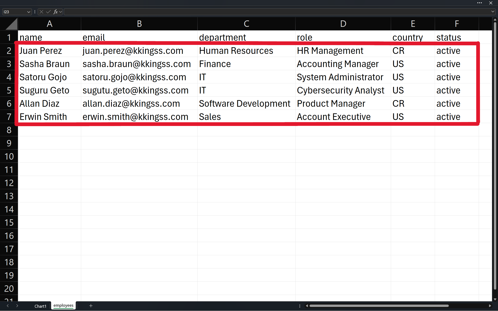

Execution logs confirm successful user creation and group assignment:

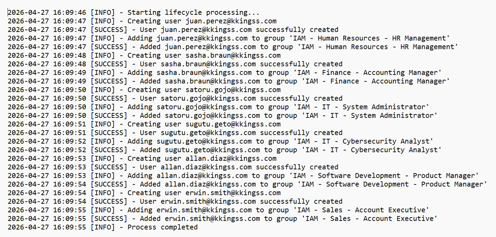

User accounts are provisioned in Entra ID:

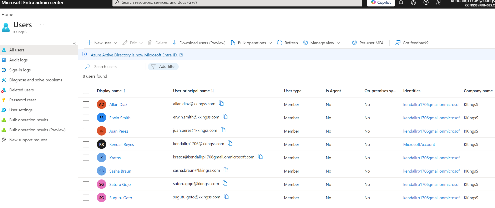

Access is automatically assigned based on role. For example, the Sales Account Executive "Erwin Smith" is granted access to "HubSpot CRM" through group membership:

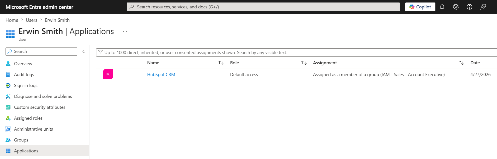

---

### Mover (Attribute & Access Updates)

When user attributes change, the system:

- Detects and applies only the modified attributes  
- Updates access only when required  

Changes are introduced in the HR system:

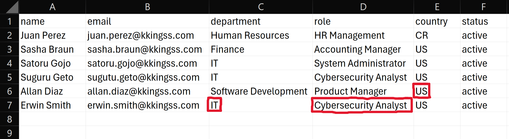

Logs confirm attribute-level updates:

- Department: Sales → IT  
- Job Title: Account Executive → Cybersecurity Analyst  

These changes trigger a group reassignment, ensuring access aligns with the new role.
For "Allan Diaz", only the Country attribute changed (CR → US), which did not require any group updates:
  
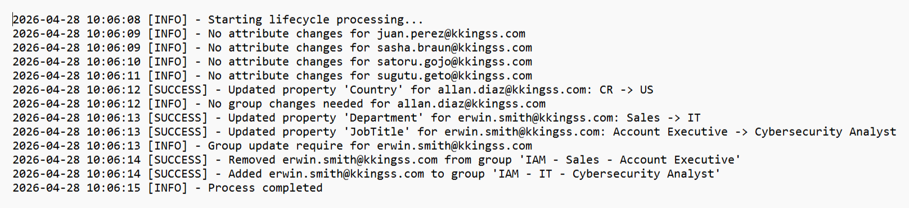

Access is adjusted accordingly. The user loses access to "HubSpot CRM" and is granted access to "ServiceNow", along with new role assignments:

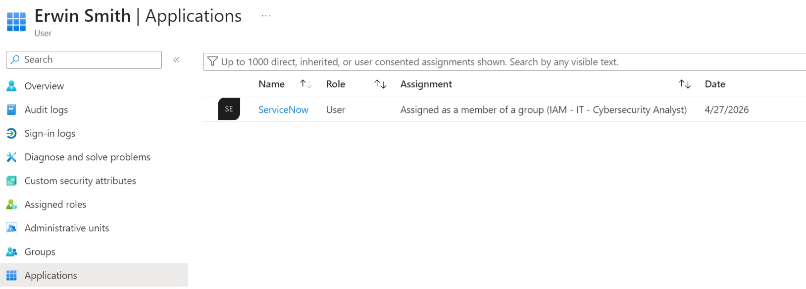
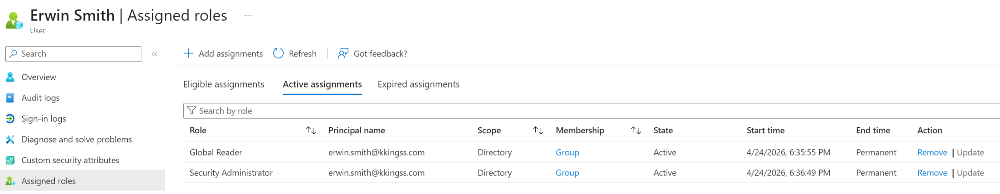

---

### Leaver (Deprovisioning)

When a user is terminated, the system enforces immediate access removal:

- Account is disabled  
- Group memberships are removed  
- Active sessions are revoked  

The user status is updated in the HR system:

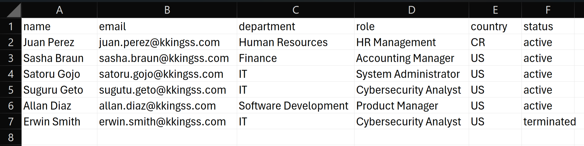

Logs confirm full deprovisioning, including group removal and session revocation:

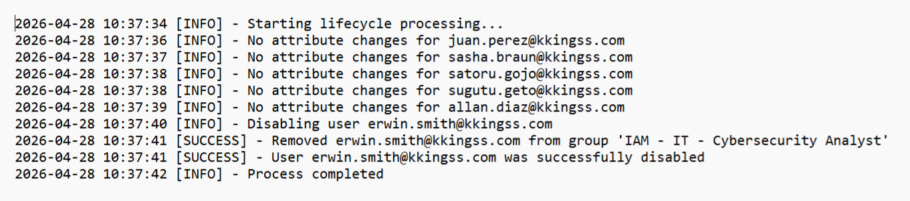

In Entra ID, the account is disabled and no longer has assigned roles or application access:

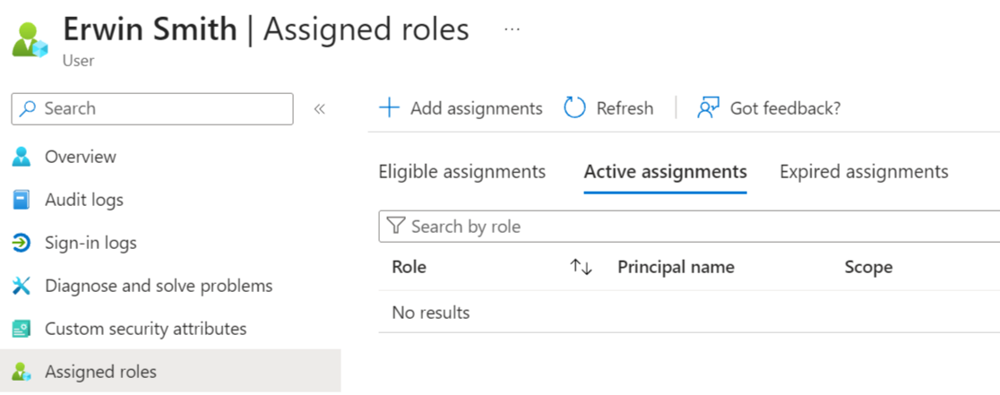
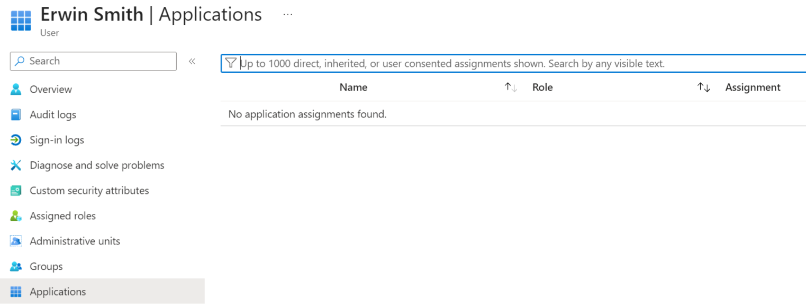

---

### Logging & Audit

The system generates structured logs for each execution, capturing all operations performed. Additionally, a cumulative log provides a full audit trail across executions.

Captured events include:

- User provisioning  
- Attribute updates  
- Access changes  
- Errors  

Example of the cumulative log:

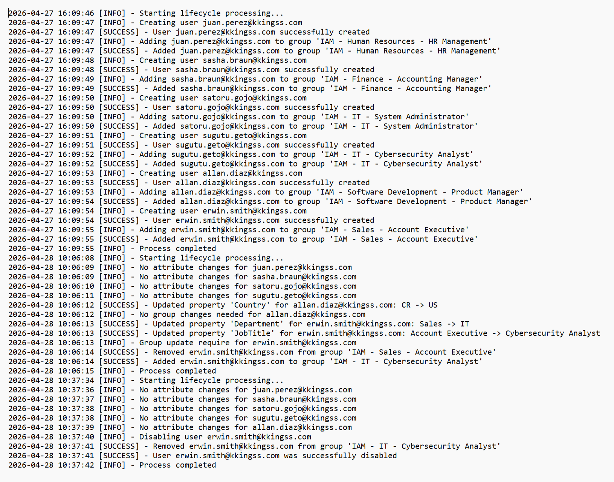

The system also enforces validation. If required attributes are missing, the user is not created and an error is logged:

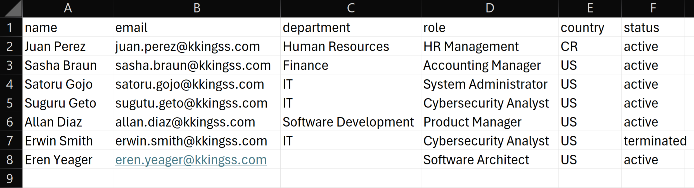
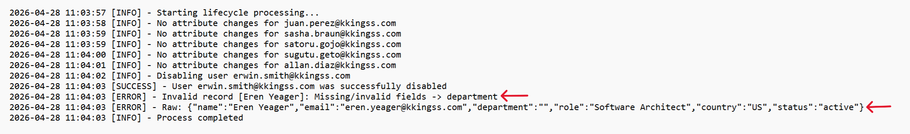

---

### Access Report

A CSV report is generated with user access information, this can be used for an IAM audit:

A CSV report is generated to provide an auditable snapshot of user access across the environment.

Example Report:

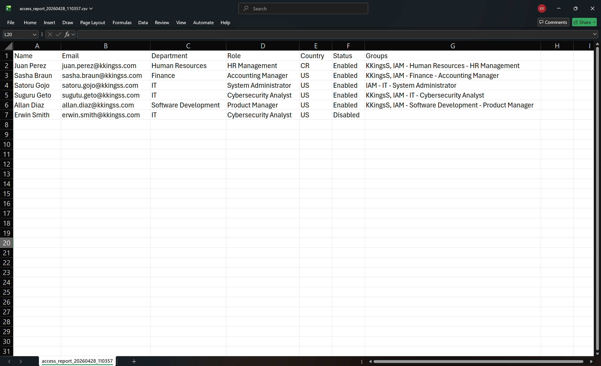

## Business Logic

### Joiner (User Provisioning)

- Creates user in Entra ID using HR data
- Assigns attributes:
  
  - DisplayName
  - UserPrincipalName
  - Department
  - Job Title
  - Country
  - Company
- Assigns users to role-based groups based on attributes

Key challenge:
- Microsoft Graph eventual consistency → handled with retry logic

### Mover (User Update)

- Detects attribute-level changes:

  - Department
  - Job Title
  - Country
- Updates only changed attributes
- Updates group membership only if role/department changed

Key feature:
- Differential updates to avoid unnecessary operations

### Leaver (Deprovisioning)

- Removes user from all groups
- Revokes active sessions
- Disables account

Security focus:

- Ensures immediate access removal

## Access Control Model

Access is assigned based on:

Department + Role → Security Group

Example:

- "IAM-IT-System Administrator"
- "IAM-Finance-Accounting Manager"

This ensures Role-Based Access Control (RBAC).

## Technologies Used

- PowerShell (automation scripting)
- Microsoft Graph API (identity operations)
- Microsoft Entra ID (identity platform)
- CSV-based HR simulation (data source)

## Challenges & Solutions

### 1. Unnecessary Updates
Issue: Users were being updated even without changes  
Solution: Implemented attribute-level comparison to ensure idempotent updates

### 2. Group Reassignment Issues
Issue: Users were removed and re-added unnecessarily  
Solution: Added group membership validation

### 3. Data Validation
Issue: Invalid HR records  
Solution: Input validation before processing

## How to Run

1. Connect to Microsoft Graph
2. Prepare CSV file
3. Run script:

```powershell
.\lifecycle_automation_v1.ps1
```

## Project Structure

```bash
lifecycle_automation/
│
├── scripts/
│   └── lifecycle_automation_v1.ps1
│
├── data/
│   └── employees.csv
│
├── logs/
│   └── sample/
│
├── docs/
│   └── screenshots/
```
 
