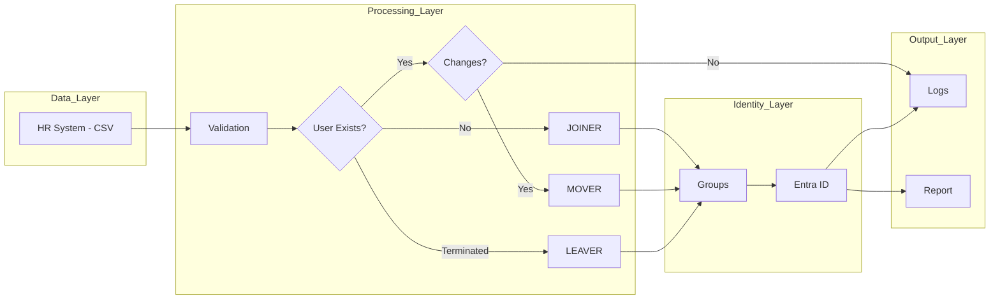

# Lifecycle Automation - Module 1

## Overview
This module simulates enterprise-grade Identity Lifecycle Automation, implementing Joiner, Mover, and Leaver (JML) processes using PowerShell, Microsoft Graph API, and Microsoft Entra ID. The goal is to simulate integration with an HR system, automate user provisioning, updates, deprovisioning, and apply role-based access control through dynamic group assignment while ensuring consistency, traceability, and alignment with access control policies.

## Objective

The goal of this module is to automate user lifecycle management:

- Provision new users (Joiner)
- Update existing users based on changes (Mover)
- Deprovision users securely (Leaver)

The system ensures:
- Consistency between HR data and Entra ID
- Proper access assignment
- Auditability through logs and reporting

## Architecture

HR System (CSV) → Validation → Entra ID (Microsoft Graph)

Processing Flow:
1. Validate input records
2. Check if user exists
3. Execute:
   - Joiner
   - Mover
   - Leaver
4. Update group memberships
5. Generate audit report

### Architecture Diagram

