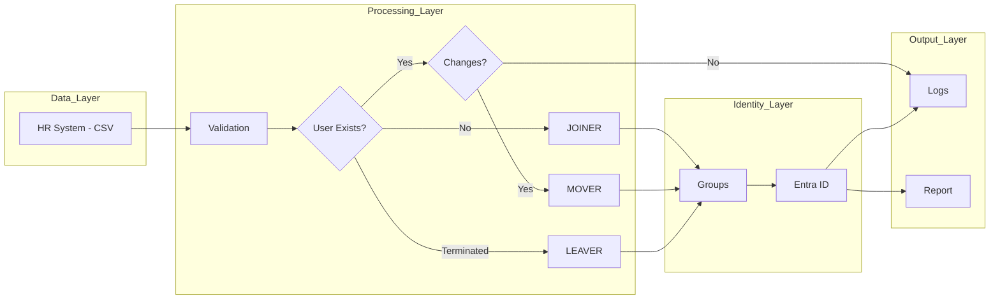

# Lifecycle Automation - Module 1

## Overview
This module simulates enterprise-grade Identity Lifecycle Automation, implementing Joiner, Mover, and Leaver (JML) processes using PowerShell, Microsoft Graph API, and Microsoft Entra ID. The goal is to simulate integration with an HR system, automate user provisioning, updates, deprovisioning, and apply role-based access control through dynamic group assignment while ensuring consistency, traceability, and alignment with access control policies.

## Objective

The goal of this module is to automate user lifecycle management:

- Provision new users (Joiner)
- Update existing users based on changes (Mover)
- Deprovision users securely (Leaver)

The system ensures:
- Consistency between HR data and Entra ID
- Proper access assignment
- Auditability through logs and reporting

## Architecture Diagram



HR System (CSV) → Validation → Entra ID (Microsoft Graph)

Processing Flow:
1. Validate input records
2. Check if user exists
3. Execute:
   - Joiner
   - Mover
   - Leaver
4. Update group memberships
5. Generate audit report

## Demonstration

The following section shows how the lifecycle automation behaves in different scenarios.

### Joiner (User Creation)

When a new user is detected in the HR system, the script:

- Creates the user in Entra ID
- Assigns attributes
- Adds the user to the correct group

#### 1. In this example, we are adding 6 new users into our HR system:


#### 2. After the script execution, we can see the logs showing the users were successfully created and were added to the IAM managed groups they belong:


#### 3. We can confirm the users were created in Entra ID:


#### 4. The users also got assigned the roles and access to apps they need depending on their role, for example the Sales Account Executive Erwin Smith got access to the app "HubSpot CRM" because he was added to the corresponding IAM group:


### Mover (User Update)

When user attributes change:

- Only modified attributes are updated
- Group membership is updated only if required

#### Example Output

## Business Logic

### Joiner (User Provisioning)

- Creates user in Entra ID using HR data
- Assigns attributes:
  
  - DisplayName
  - UserPrincipalName
  - Department
  - Job Title
  - Country
  - Company
- Adds user to role-based group (based on attributes)

Key challenge:
- Microsoft Graph eventual consistency → handled with retry logic

### Mover (User Update)

- Detects attribute-level changes:

  - Department
  - Job Title
  - Country
- Updates only changed attributes
- Updates group membership only if role/department changed

Key feature:
- Differential updates to avoid unnecessary operations

### Leaver (Deprovisioning)

- Removes user from all groups
- Revokes active sessions
- Disables account

Security focus:

- Ensures immediate access removal

## Access Control Model

Access is assigned based on:

Department + Role → Security Group

Example:

- "Human Resources - HR Management"
- "IT - System Administrator"

This ensures Role-Based Access Control (RBAC).

## Logging & Audit

The system generates structured logs including:

- User creation
- Attribute changes
- Group assignments/removals
- Errors

Example:

- [INFO] Creating user
- [SUCCESS] User created
- [ERROR] Failed to add user to group

The purpose is to improve traceability and audit readiness

## Reporting

A CSV report is generated with:

- Name
- UPN
- Department
- Role
- Groups

This provides a snapshot of user access for auditing purposes.

## Technologies Used

- PowerShell
- Microsoft Graph API
- Azure Entra ID
- CSV (HR system simulation)

## Challenges & Solutions

### 1. Unnecessary Updates
Issue: Users were being updated even without changes  
Solution: Implemented attribute comparison logic

### 2. Group Reassignment Issues
Issue: Users were removed and re-added unnecessarily  
Solution: Added group membership validation

### 3. Data Validation
Issue: Invalid HR records  
Solution: Input validation before processing

## How to Run

1. Connect to Microsoft Graph
2. Prepare CSV file
3. Run script:

```powershell
.\lifecycle_automation_v1.ps1
```

## Project Structure

- script/
  - lifecycle_automation.ps1
- data/
  - employees.csv
- logs/
  - lifecycle logs
  - access_report.csv
 
