# Lifecycle Automation - Module 1

## Overview

This module simulates enterprise-grade Identity Lifecycle Automation using Microsoft Entra ID, Microsoft Graph API, and PowerShell.

The implementation automates Joiner, Mover, and Leaver (JML) processes by integrating HR-driven identity data with automated provisioning, access assignment, lifecycle updates, and deprovisioning workflows.

The solution focuses on scalable identity governance, RBAC-based access control, auditability, and operational consistency aligned with enterprise IAM practices.

---

## Architecture Diagram

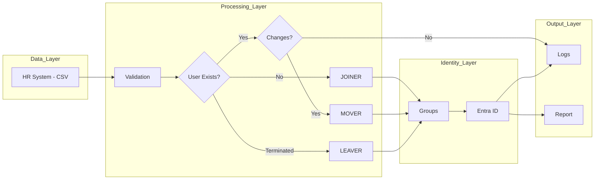
```mermaid
flowchart LR

subgraph Data_Layer
    A[HR System - CSV]
end

subgraph Processing_Layer
    B[Validation]
    C{User Exists?}
    D[JOINER]
    E{Changes?}
    F[MOVER]
    G[LEAVER]
end

subgraph Identity_Layer
    H[Entra ID]
    I[Groups]
end

subgraph Output_Layer
    J[Logs]
    K[Report]
end

A --> B
B --> C

C -->|No| D
C -->|Yes| E

E -->|No| J
E -->|Yes| F

C -->|Terminated| G

D --> I
F --> I
G --> I

I --> H
H --> J
H --> K
```

### Processing Flow

1. Validate HR input records
2. Detect lifecycle state
3. Execute Joiner, Mover, or Leaver workflow
4. Update RBAC group membership
5. Generate audit logs and reporting artifacts

---

## Key Capabilities

- Automated Joiner, Mover, and Leaver workflows
- RBAC-based access provisioning
- Differential attribute updates
- Automated group reassignment
- Session revocation and deprovisioning
- Structured audit logging and reporting
- HR-driven identity lifecycle automation
- Microsoft Graph API integration

---

## Lifecycle Scenarios

### Joiner — User Provisioning

The Joiner workflow automatically provisions users, assigns identity attributes, and applies RBAC access based on HR identity data.

#### HR Input

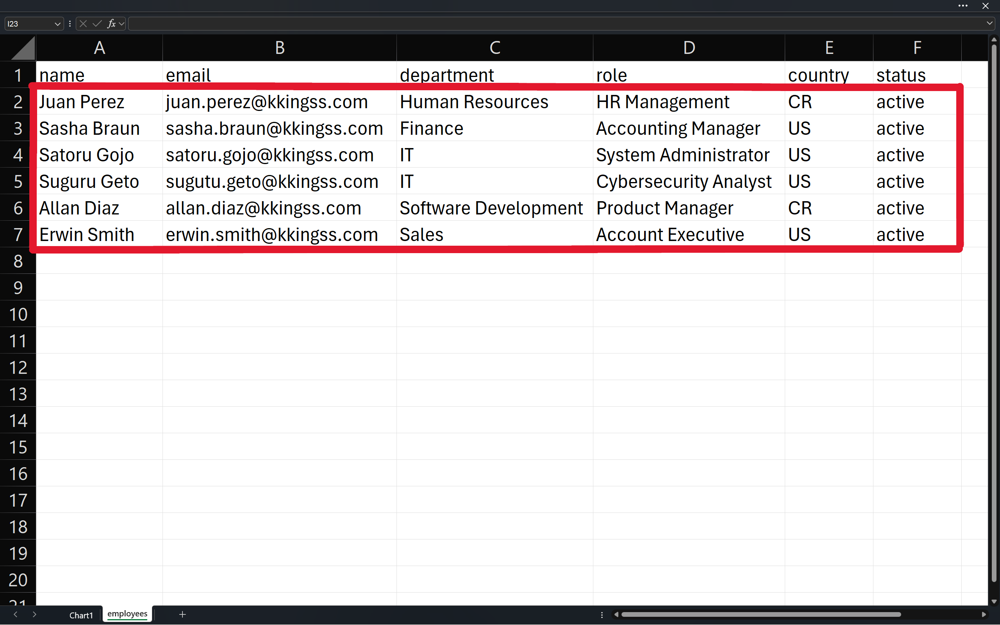

#### Automation Execution

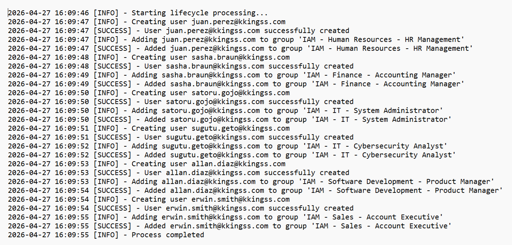

#### Provisioned Identity

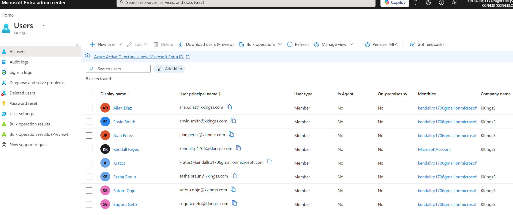

#### Access Assignment

The Sales Account Executive "Erwin Smith" automatically receives access to HubSpot CRM through IAM-managed group membership.

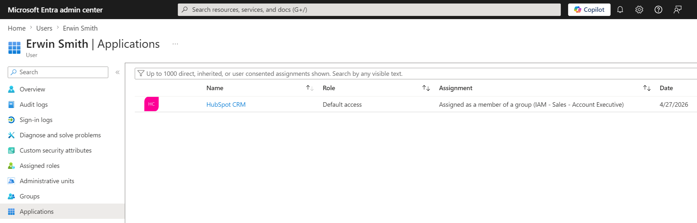

---

### Mover — Attribute and Access Updates

The Mover workflow detects identity attribute changes and updates access only when required.

#### HR Attribute Changes

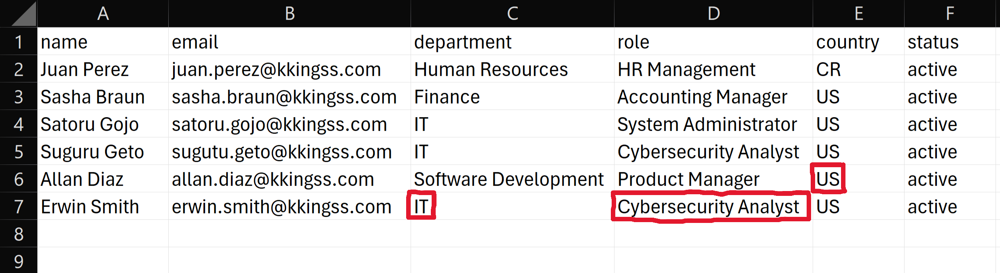

#### Differential Update Detection

The automation updates only modified attributes and reevaluates group membership when role or department changes occur.
  
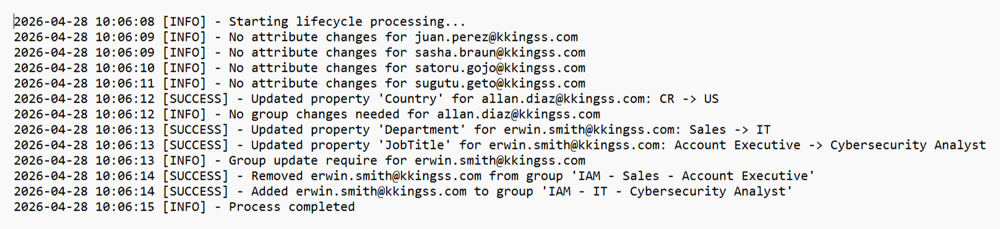

#### Access Reassignment

The user loses access to HubSpot CRM and receives ServiceNow access and updated role assignments aligned with the new role.

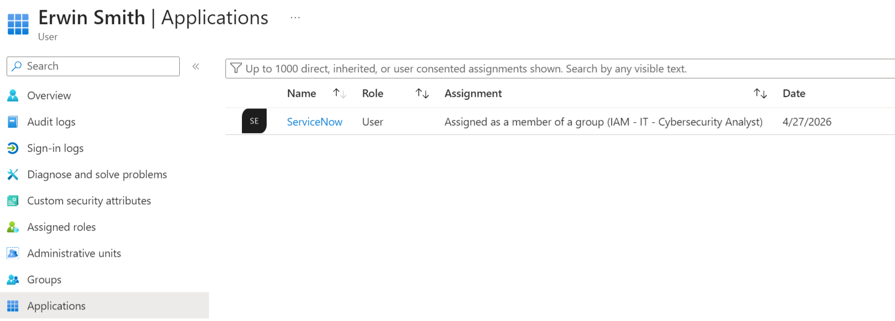
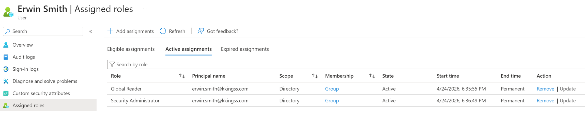

---

### Leaver — Deprovisioning

The Leaver workflow enforces immediate access removal and account deactivation.

#### HR Status Update

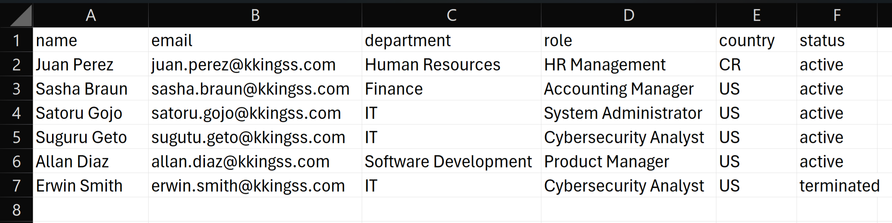

#### Deprovisioning Execution

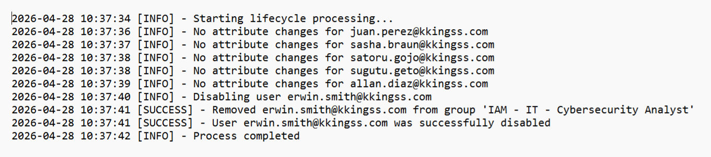

#### Access Removal Validation

The account is disabled and all access assignments are removed.

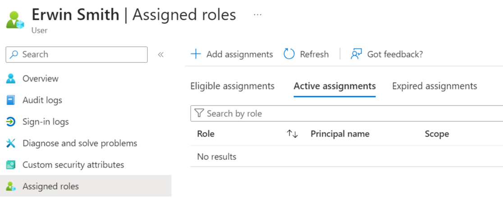
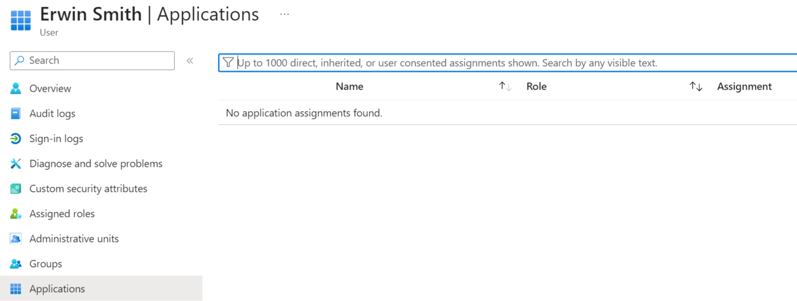

---

### Access Reporting

The automation generates structured CSV reports containing user access and governance data.

The reports provide an auditable snapshot of:

- User lifecycle status
- Group memberships
- Assigned access
- Identity attributes

#### Example Report

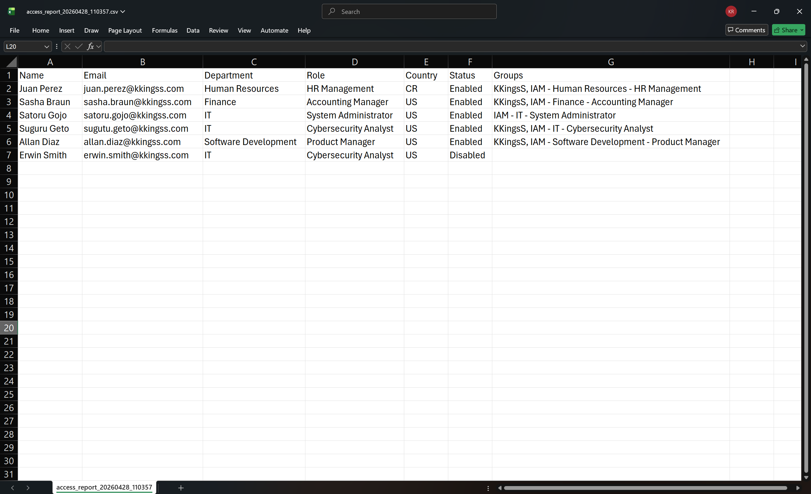

---

### Logging and Audit

Structured logs are generated for every execution to maintain auditability and operational traceability.

#### Logged Events

- User provisioning
- Attribute updates
- Access reassignment
- Deprovisioning actions
- Validation failures
- Operational errors

#### Audit Log Example

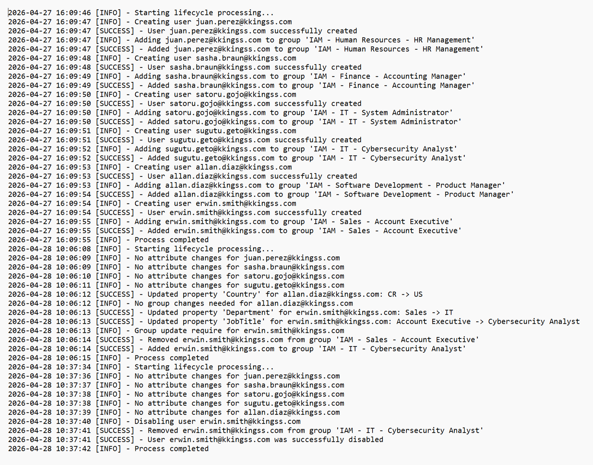

#### Validation Enforcement

Invalid HR records are rejected and logged before processing.

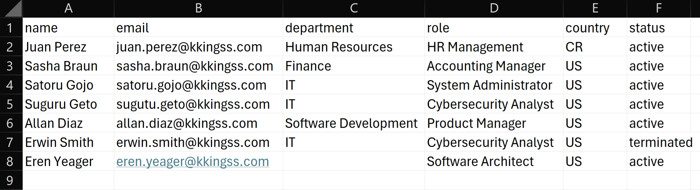
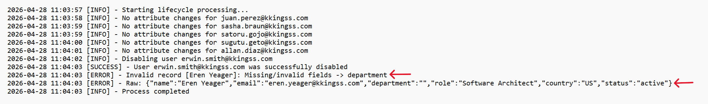

---

## Automation Logic

### Joiner

- Creates user identities in Entra ID
- Assigns identity attributes
- Applies RBAC access through group membership

#### Key Feature

Retry logic handles Microsoft Graph eventual consistency during provisioning.

---

### Mover

- Detects attribute-level changes
- Updates only modified attributes
- Reassigns access when role or department changes occur

#### Key Feature

Differential updates reduce unnecessary operations and improve efficiency.

---

### Leaver

- Removes group memberships
- Revokes active sessions
- Disables user accounts

#### Security Focus

Immediate access removal reduces post-termination exposure.

---

## Access Control Model

Access assignment follows a standardized RBAC model:

```text
Department + Role → IAM Security Group
```

### Examples

- IAM-IT-System Administrator
- IAM-Finance-Accounting Manager

This model ensures centralized and governance-aligned authorization management.

---

## Technologies

- Microsoft Entra ID
- Microsoft Graph API
- PowerShell
- CSV-based HR simulation

---

## Engineering Challenges

| Challenge | Solution |
|---|---|
| Unnecessary updates | Implemented attribute-level comparison for idempotent updates |
| Group reassignment issues | Added group membership validation |
| Invalid HR data | Implemented pre-processing validation |
| Microsoft Graph eventual consistency | Added retry logic during provisioning |

---

## Project Structure

```bash
lifecycle-automation/
├── scripts/
├── data/
├── logs/
└── docs/
```

---

## Key IAM Concepts Demonstrated

- Identity lifecycle automation
- RBAC-based access provisioning
- Automated access governance
- Differential identity updates
- Identity deprovisioning
- Audit logging and traceability
- HR-driven identity orchestration
- Microsoft Graph API automation
 
---

## Conclusion

This module demonstrates how enterprise IAM lifecycle processes can be automated using Microsoft Entra ID, PowerShell, and Microsoft Graph API.

The implementation reflects real-world IAM engineering practices focused on automation, governance, operational consistency, and secure identity lifecycle management.
